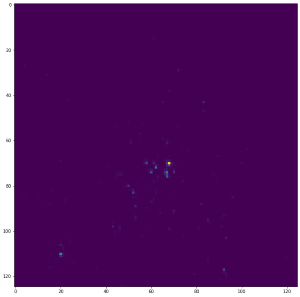
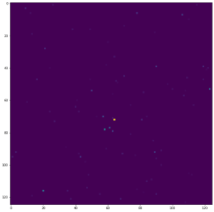

# GSoC 2022 Progress Report
This is the official repository for my GSoC 2022 project with ML4SCI.
Titled: **Vision Transformers for End-to-End Particle Reconstruction for the CMS Experiment**
This project aims to add Vision Transformer and related models to the already present CMS E2E
pipeline for more accurate analysis and classification. 
<ins>This is repository is still under-development and may contain some unnecessary files</ins>. 
Note: Till completion this report will act as **progress report** for the project and will be converted
to a detailed documentation once the development phase is over
***
### Problem Statement
If the reader has idea of what he/she is dealing with I would advise to proceed further.

In this project we are working with multi-detector images corresponding to true maps of low-level
energy deposits in the detector for various type of particle collision events in CMS(CERN).
In laymans term we are using the data generator by the detectors in the CMS experiment to 
learn more about the particles and analyse them. The used in our case are Monte-Carlo simulated 
data. We are using the follwing data and contructing images(jet image) out of them and using
Machine Learning to analyse(in our case Classify) them. Differnt types of detectors or sensors
produce different types of data or in our case jet images.

These are some jet images for the Quarks and Gluons
| HCAL | ECAL | TRACKS |
| ---- | --- | --- |
|  |  |  |

***
### Approach
Previously there have been attempts to classify the images ResNet based architectures. In our case
we will Transformers namely Vision Transformers and various state of the art Transformer based models to
achieve a somewhat higher score that the previous attemps.

The following models were tested for the task:-
* [Vision Tranformers](https://arxiv.org/abs/2010.11929)
* [Swin Transformers](https://arxiv.org/abs/2103.14030)
* [CoAt nets](https://arxiv.org/abs/2106.04803)
* [MaxViT](https://arxiv.org/abs/2204.01697)
* [DaViTs](https://arxiv.org/abs/2204.03645)
* [Efficient Nets](https://arxiv.org/abs/1905.11946)
* [ResNets(ResNet 15)](https://arxiv.org/abs/1512.03385) 

Note: The model Vision Transformers was very unstable for our use case and hence was discarded
***
### Input PipeLine
Inputs Pipe are a crucial component when building Machine Learning Model. Moreover
since here we are dealing with a large number of file(~700k) a good and efficient pipe
is a must for scalability.

#### PipeLine 1 [Depreciated]
This pipeline was majorly used to train PyTorch based models on GPUs. Since
GPUs can deal with somewhat less efficient pipelines and we need to have the model 
up and running as early as possible this was chosen. 

The pipe-line is shown below

***
The codes for converting the parquets to data along with the preprocession can
be found [here]
***
#### PipeLine 2
This pipeline is built keeping in mind performance.
This pipeline is robust enough to serve data to a **TPU** without bottlenecking.
It is an extension of the previous pipeline. We take the .png files made by the
previous pipeline and convert them to TFRecords for faster performance. The TFRecords files 
are sharded in parts of 10240 images each file. The files are later read by tf.data API to prevent 
even the slightest bottleneck. This pipeline is utilised for training on TPUs.

***
The codes for converting the .png files to Parquet files can be found [here]

***
***

 
